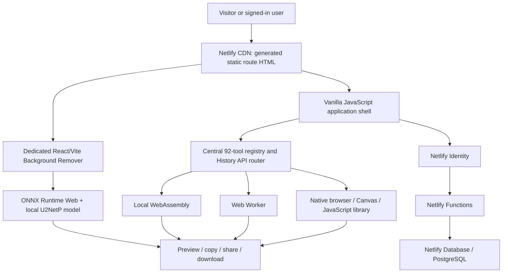
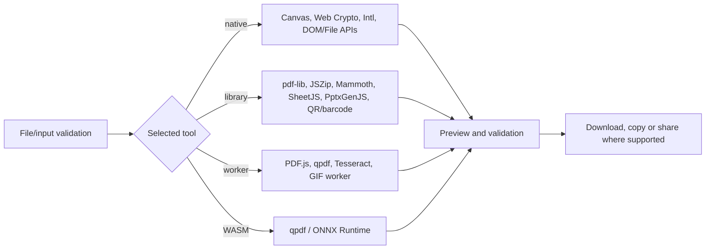
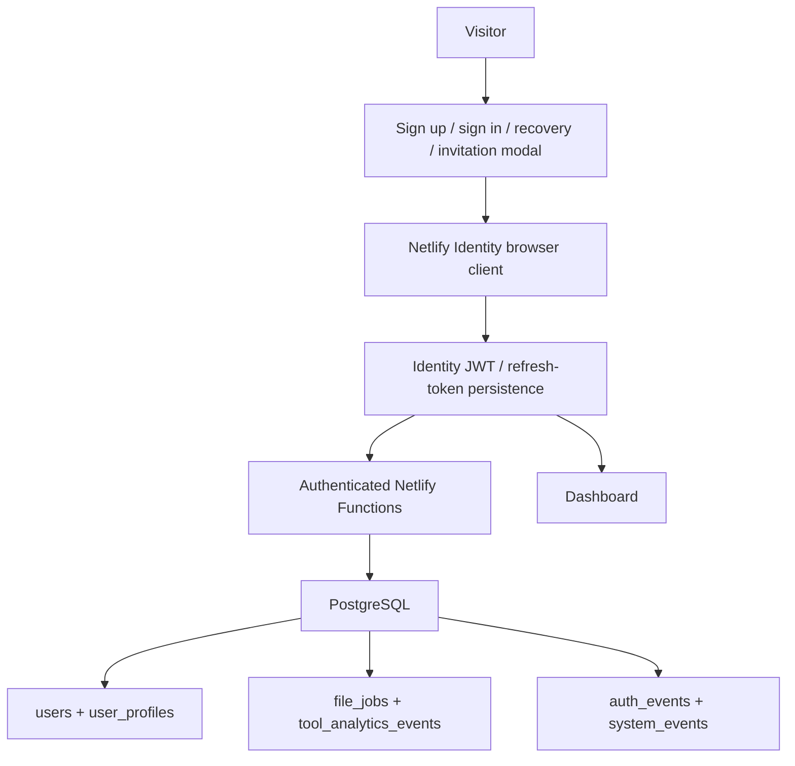
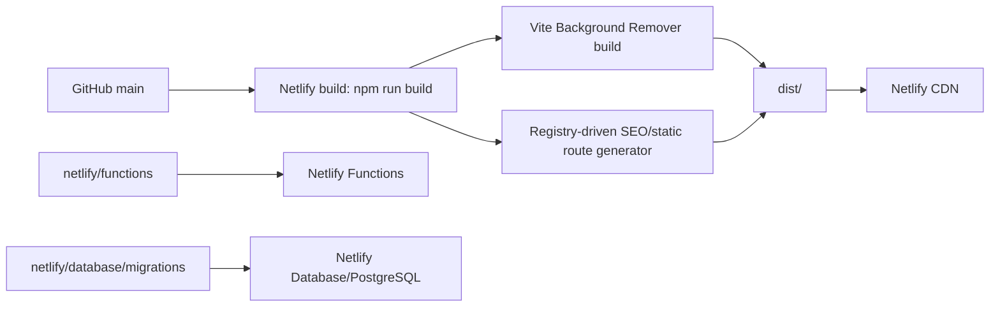

# Product Architecture

## System shape

GXA Toolbox is a hybrid static/browser/serverless application:

Uploaded file bytes remain in the browser for the verified processing paths. Functions receive identity/profile, history/job metadata, tool-event, session and admin analytics data; the audit found no primary file-processing upload path to a Function.

## Frontend

- **Primary app:** static HTML template plus `public_html/assets/app.js`, shared CSS, workspace helpers, content-page registry and tool-specific modules.
- **Background Remover:** standalone React 19 + TypeScript + Vite application under `/background-remover/`, using Zustand and ONNX Runtime Web.
- **State:** in-memory application state plus `localStorage` for preferences such as theme, favorites, remembered search/recent state and related convenience data.
- **Navigation:** clean directory routes with History API interception and `popstate`; static route shells remain independently loadable and crawlable.
- **Rendering:** generated route HTML supplies page-specific head metadata and crawlable page identity; the runtime hydrates the interactive application.

## Processing architecture

Heavy components are generally route/action loaded, including PDF.js, Cropper, html2canvas, Mammoth, SheetJS, Tesseract and PptxGenJS. pdf-lib, JSZip and Lucide are currently global CDN scripts on the main public shell.

## Authentication and data

- Netlify Identity owns user credential hashing, verification, recovery, invitation and JWT issuance.
- `_identity-profile.mjs` validates Identity claims and synchronizes application profile data.
- The dashboard is a generated private/noindex route. Anonymous users see a sign-in state.
- Legacy register/login/logout Function paths remain for compatibility but deliberately return HTTP 410.
- Admin access is separate: environment-provided credentials, constant-time comparison, HMAC-signed Secure/HttpOnly/SameSite=Lax cookie.

## Database

Four deployment migrations create six application tables: `users`, `user_profiles`, `file_jobs`, `tool_analytics_events`, `auth_events`, and `system_events`. Queries use `@netlify/database` tagged SQL. Relationships and policies are detailed in `07_AUTH_DATABASE.md`.

## Build and hosting

Only the allowlisted `dist/` output is published. The generated output preserves Background Remover model/runtime assets, tool bundles, `robots.txt`, `sitemap.xml`, `ads.txt`, icons and a real `404.html`. There is no broad 200 SPA fallback.

## Architecture classifications

| Layer | Current implementation | Confidence |
|---|---|---|
| UI | Vanilla JS SPA-like shell + standalone React tool | VERIFIED |
| Routing | Static directory routes + History API | VERIFIED |
| Processing | Client-side native/library/Worker/WASM | VERIFIED |
| User identity | Netlify Identity | VERIFIED |
| Server | Netlify Functions | VERIFIED |
| Data | Netlify Database/PostgreSQL | VERIFIED |
| Hosting | Netlify static `dist/` | VERIFIED |
| SEO | Registry-driven static HTML generation | TESTED |
| Offline PWA | Manifest present; no Service Worker | VERIFIED |
