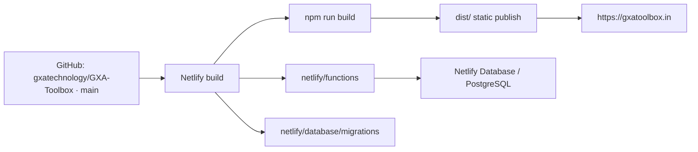

# Deployment and Infrastructure

## Verified production topology

## Configuration

| Item | Verified value |
|---|---|
| Repository | `gxatechnology/GXA-Toolbox` |
| Primary branch | `main` |
| Build command | `npm run build` |
| Publish directory | `dist` |
| Functions directory | `netlify/functions` |
| Function bundler | esbuild |
| Database migrations | `netlify/database/migrations` (4 files) |
| Production domain | `https://gxatoolbox.in` |
| Static route generation | Registry-driven Node generator |
| Public HTML entrypoints | 99 |
| Private/noindex direct routes | 2 |
| 404 | Generated real `404.html` |

## Build stages

The production build lints source, builds the React/Vite Background Remover, runs route/SEO generation and executes the normal test contracts. Generation copies only allowlisted public assets into `dist/`, creates route-specific HTML, emits `robots.txt`, `sitemap.xml`, `ads.txt` and the real 404, and preserves the Background Remover's model/WASM/module assets.

## Routing and headers

- No global `/* → /index.html 200` fallback remains.
- Clean tool/content directories resolve to generated `index.html` files.
- Canonical host and index/trailing aliases are normalized through redirects.
- Auth/session Function mappings remain explicit.
- `robots.txt`, `sitemap.xml`, manifest, ads and icons are served as static files with appropriate content types.
- Baseline headers include HSTS, no-sniff, frame restrictions and referrer controls; private routes/functions add noindex/no-store.
- The CSP is only partial and should be expanded carefully around Identity, GTM, AdSense and current CDN resources.

## Required environment configuration

Netlify Database/Identity integration values, admin credentials/session secret and platform deployment context must be configured in Netlify. This report does not reveal secret values. GTM and AdSense identifiers are public site identifiers, not secrets.

## Deployment workflow

1. Review/commit source and documentation changes on the intended branch.
2. Push to GitHub only after approval.
3. Netlify runs `npm run build` and deploys `dist/` plus Functions.
4. Database migrations are discovered/applied through the supported Netlify Database workflow.
5. Run post-deploy route/header/auth/database/tool smoke tests.

This audit did not commit, push or deploy.
