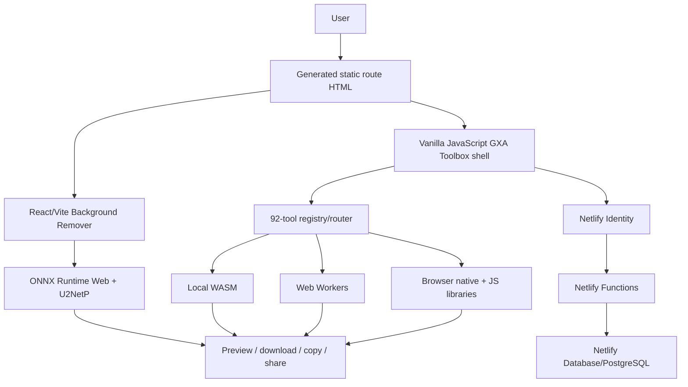

# GXA Toolbox Master Product, Technical and Business Intelligence Report

Audit date: 2026-08-16
Product: GXA Toolbox
Company: GXA Technologies
Production domain: `https://gxatoolbox.in`
Repository/branch: `gxatechnology/GXA-Toolbox` / `main`

This is a documentation-only audit of the current local source and generated build. It does not change production code, dependencies, configuration, migrations, git state or deployment.

## 1. Executive dashboard

| Metric | Verified value |
|---|---:|
| Registered Tools | 92 |
| Categories | 6 |
| Public user-facing route entrypoints | 99 |
| Physical source HTML files | 6 |
| Generated HTML entrypoints | 102 |
| Generated direct routes | 101 |
| Browser/client processing workflows | 91 working |
| Fully working browser classification | 59 |
| Worker-powered workflows | 5 dedicated; PDF.js adds shared Worker use |
| WASM-primary tools | 3 |
| Serverless file-processing tools | 0 |
| AI/ML workflows | 3 |
| Netlify Function modules | 19 |
| Database tables | 6 |
| Processing engines/platforms | 14 major families listed in facts JSON; additional UI/runtime libraries documented |
| Direct dependencies | 27 unique |
| Vendored libraries | 7 families / 8 bundle groups |
| Test files | 25 |
| Normal automated suite files | 23 |
| Original authored application LOC | ≈33,928 |
| Production host | Netlify |
| Mobile support | Responsive architecture; representative 390×844 render tested |
| Authentication | Netlify Identity |
| Dashboard | User + admin routes, both noindex |
| Current major limitation | PPT to PDF lacks a faithful renderer |

Confidence labels: **VERIFIED** directly confirmed in source/build; **TESTED** exercised successfully; **DOCUMENTED** project documentation without independent execution; **INFERRED** strongly indicated; **UNKNOWN** insufficient evidence.

## 2. Repository inventory

The baseline inventory was captured before creating `docs/master-audit/`, using tracked plus non-ignored untracked files and excluding `node_modules` and ignored `dist`.

| Class | Files |
|---|---:|
| Total baseline files | 330 |
| Baseline directories | 51 |
| Source | 142 |
| Documentation | 38 |
| Test/fixtures | 92 |
| Vendored | 30 |
| Static assets | 21 |
| Identifiable generated | 7 |
| Fixture files | 67 |

### Extensions and assets

HTML 6; CSS 5; JS 28; MJS 52; TypeScript 33; TSX 26; PHP 19; JSON 13; Markdown 30; SQL 6; TOML 1; webmanifest 2; WASM 12; PNG 28; JPG 22; WEBP 3; SVG 2; ZIP 2; PDF 10; and additional fixture/document formats. There are 53 image files, five Worker-named files and no local font files.

### Original-code LOC methodology

Vendored/minified/generated files are excluded from original product LOC.

| Authored application language | LOC |
|---|---:|
| JavaScript | 17,251 |
| MJS | 2,099 |
| TypeScript | 2,223 |
| TSX | 988 |
| CSS | 7,955 |
| HTML | 311 |
| PHP | 2,629 |
| SQL | 472 |
| **Total authored application code** | **33,928** |

Test code is approximately 2,673 LOC. Pre-audit documentation was approximately 1,866 LOC. JSON/config/data are tracked separately because large structured registries/lock data can inflate “code” comparisons.

## 3. Product and system architecture

GXA Toolbox combines a registry-driven static application shell, client-side engines, a specialized React image editor and serverless identity/metadata services.

The main file-processing path does not send uploaded bytes to Functions. Identity/profile/history/event metadata does use hosted services. See [02_PRODUCT_ARCHITECTURE.md](02_PRODUCT_ARCHITECTURE.md).

## 4. Pages, routes and indexability

- 92 registered tool routes.
- Six company/legal routes.
- One homepage.
- 99 public entrypoint pages.
- Two private/noindex routes: dashboard and admin.
- 101 generated direct routes and 102 HTML entrypoints including the real 404.
- 98 sitemap URLs: home + 91 working tools + six content pages.
- Five modal authentication screens, not public indexable routes.

The registry's 92nd tool is Image OCR; any “91 tools” copy in the brief is stale. PPT to PDF is generated for route compatibility but noindex and absent from the sitemap. See [03_PAGE_ROUTE_INVENTORY.md](03_PAGE_ROUTE_INVENTORY.md) and [04_91_TOOL_MATRIX.md](04_91_TOOL_MATRIX.md).

## 5. Tool/category snapshot

| Category | Count | Share | Major capability | Main engines | Principal limitation |
|---|---:|---:|---|---|---|
| PDF | 22 | 23.9% | Page/document edit, security, extraction, OCR | pdf-lib, PDF.js, qpdf, Tesseract | Memory/fidelity; OCR/resource limits |
| Image | 5 | 5.4% | Compress, resize, crop, OCR, cutout | Canvas, Cropper, Tesseract, ONNX | Device memory/model/capability |
| Convert | 21 | 22.8% | Document/image/ebook/spreadsheet/GIF representations | PDF.js, pdf-lib, JSZip, Mammoth, SheetJS, PptxGenJS | Cross-format fidelity; PPT blocker |
| ZIP | 2 | 2.2% | Create/extract archives | JSZip | Buffer/decompression memory |
| Utility/Developer | 27 | 29.3% | Text/data/code/identifier/color/metadata/code tools | Browser APIs, project parsers, QR/barcode, exifr | Browser APIs and lightweight grammar limits |
| Calculator | 15 | 16.3% | Everyday/date/finance/health/conversion calculations | Native JS/Date/Math | Assumptions; not advice/live data |

Status totals: 59 fully working browser, three fully working WASM, 29 working with browser limitations and one not currently feasible.

## 6. Engines and processing

Major verified engines include Canvas/Web APIs, pdf-lib, PDF.js, JSZip, qpdf WASM, ONNX Runtime Web, Tesseract.js, Mammoth, SheetJS, PptxGenJS, gifenc, a custom GIF decoder, Cropper.js, QRCode.js, JsBarcode, BarcodeDetector, exifr and html2canvas. Infrastructure/runtime layers include React, Zustand, Netlify Identity, Functions and PostgreSQL.

Dedicated Worker workflows are qpdf Protect/Unlock, GIF Maker and the two OCR workflows. PDF.js additionally runs shared Worker execution for PDF-reading tools. WASM-primary tools are Background Remover, Protect PDF and Unlock PDF; OCR's core is also WASM but its audit status is browser-limited.

See [05_ENGINE_TECHNOLOGY_STACK.md](05_ENGINE_TECHNOLOGY_STACK.md).

## 7. Product features

Implemented product-wide capabilities include global search, command palette, category filtering, favorites/recent items, dashboard/admin routes, Netlify Identity flows, profile/history metadata, dark mode, responsive desktop/mobile navigation, upload/validation, previews/results, downloads, copy/share where relevant, toasts, loading/progress, direct route SEO, sitemap/robots/schema, GTM, AdSense site code, manifest and a real 404.

Partial areas include true localization, Contact Support delivery, universal cancellation, exhaustive undo/share, accessibility automation, offline behavior and privacy-session wording. No Service Worker, billing, premium entitlements, uploaded-file storage, live exchange-rate API or faithful PPT renderer is present.

See [06_FEATURE_INVENTORY.md](06_FEATURE_INVENTORY.md).

## 8. Authentication and database

Netlify Identity owns user credentials, JWT/session persistence, recovery and invitations. Authenticated Functions synchronize profiles and history/job/event metadata into six PostgreSQL tables: `users`, `user_profiles`, `file_jobs`, `tool_analytics_events`, `auth_events`, and `system_events`. Four migrations define the schema. Legacy custom user login/register/logout handlers intentionally return 410.

Admin authentication uses environment credentials, constant-time comparison and an HMAC-signed Secure/HttpOnly/SameSite=Lax cookie. No app-level rate limiting/lockout was verified.

See [07_AUTH_DATABASE.md](07_AUTH_DATABASE.md).

## 9. Privacy and security

Safe claim: the audited primary processing paths keep uploaded file content in the browser. Unsafe blanket claims include 100% offline, zero network, anonymous/no tracking, all browsers, live rates and certificate-based signing.

Highest-priority findings:

1. Public auth/session wording describes the retired user cookie model rather than current Netlify Identity.
2. Contact Support targets an unmapped PHP endpoint on Netlify.
3. CSP is partial and needs a tested script/connect policy.
4. Client token persistence increases the impact of XSS, reinforcing the CSP/dependency priority.
5. Custom admin auth lacks verified application throttling/lockout.

See [08_PRIVACY_SECURITY.md](08_PRIVACY_SECURITY.md).

## 10. Performance and mobile

The main local JS/CSS surface is approximately 971 KB raw, plus remote pdf-lib/JSZip/Lucide. Background Remover is isolated and its ~24.3 MB WASM plus ~4.6 MB model load only for that workflow. Many specialized engines are lazy loaded. Browser memory—not compressed input size—is the central mobile constraint.

Representative local pages were rendered at 1366×768 and 390×844. No body/document horizontal overflow was detected; the mobile drawer exposed tool categories, Dashboard, language, theme, support and account actions with scroll lock. This is representative, not exhaustive device/touch QA.

See [09_PERFORMANCE_MOBILE.md](09_PERFORMANCE_MOBILE.md).

## 11. Testing and quality

There are 25 test source files and 67 fixtures. The normal run executes 17 Node contracts and six Background Remover Vitest files. Source contains 703 Node assertion call sites plus 10 named Vitest cases; looped contracts make an exact runtime-assertion total inappropriate.

Latest verified pre-audit results: `npm ci`, lint, tests, production build, explicit PostgreSQL integration and diff check all passed. The important gap is true real-browser E2E across every file-processing and touch/editor path.

See [10_TESTING_QA.md](10_TESTING_QA.md).

## 12. Deployment and infrastructure

GitHub `main` feeds Netlify. `npm run build` emits allowlisted `dist/`; Functions live under `netlify/functions`; four migrations live under `netlify/database/migrations`. A broad 200 SPA fallback is absent, source/PHP/SQL/tests are excluded from the publish output, and a real 404 is tested.

See [11_DEPLOYMENT_INFRASTRUCTURE.md](11_DEPLOYMENT_INFRASTRUCTURE.md).

## 13. Dependencies and licenses

There are 10 unique direct production and 17 unique direct development packages. Seven vendored library families span eight checked-in bundle groups. Legal-review items include JSZip's dual-license choice, U2NetP model provenance/license, OCR core/language data, Google Fonts and transitive notices.

See [12_DEPENDENCIES_LICENSES.md](12_DEPENDENCIES_LICENSES.md).

## 14. SEO, AEO and GEO

SEO readiness is strong: unique static route identity, canonical, robots, OG/Twitter, structured data, internal anchors, sitemap and real 404. AEO and GEO readiness are moderate: content is descriptive, but tool-specific answer content, external entity evidence, authoritative authorship and corrected privacy copy are needed. No fake schema/ratings/reviews/offers are present.

See [13_SEO_AEO_GEO.md](13_SEO_AEO_GEO.md).

## 15. Top ten product differentiators

1. 92 verified routes in six categories.
2. 91 working client-side workflows.
3. Deep 22-tool PDF surface.
4. Local qpdf WASM document security.
5. Local ONNX background removal with manual refinement.
6. Two OCR workflows using Tesseract Worker/WASM.
7. Broad conversion/developer/calculator coverage under one UX.
8. Clean static search routes and registry-driven SEO generation.
9. Responsive navigation/workspaces rather than a desktop-only directory.
10. Honest output/fidelity labeling, including an explicit PPT blocker.

## 16. Competitive-positioning framework

This audit does not assert current competitor facts. Future comparisons with Smallpdf, iLovePDF, TinyWow, PDF24, Canva tools, Acrobat online, image utilities, calculator sites and developer utility sites should use a dated/source-cited scorecard:

| Dimension | GXA evidence to measure | Competitor research requirement |
|---|---|---|
| Tool count | Registry count and working-status count | Count current public functional tools, not marketing categories |
| PDF capability | 22-route matrix and fidelity | Exercise equivalent workflows |
| Image/AI | Five image tools, ONNX/OCR | Verify local/server model and editor depth |
| Converters | 21 routes with limitation labels | Compare actual output fidelity |
| Calculators/developer tools | 15 + 27 | Compare breadth and UX |
| Local processing/privacy | Audited client file paths | Read policies and test network traffic |
| Account/dashboard | Identity/profile/history metadata | Compare retention/storage behavior |
| Mobile | Representative responsive QA | Test same device/task matrix |
| Speed | No universal benchmark yet | Run identical fixtures/devices/network |
| Pricing/ads | Free public UI + AdSense readiness | Record dated plans/ad density |
| File limits/batch | Route-specific budgets | Test published/enforced limits |
| SEO/direct routes | 98 sitemap URLs | Compare crawlable route identity |

## 17. Marketing intelligence

The verified messaging platform is “92 focused tools, six categories, browser-first processing, advanced local engines, clear limitations.” Avoid absolute privacy/offline/browser compatibility claims. The detailed pack includes 25 verified claims, 20 feature statements, 10 headlines, 10 subheadlines, 20 social angles, 10 Reel concepts, 10 blog ideas, 10 landing-page ideas, 20 FAQs and six pitch lengths/types.

See [14_MARKETING_INTELLIGENCE.md](14_MARKETING_INTELLIGENCE.md).

## 18. Monetization

Ad-supported operation is technically prepared at site-code/ads.txt level but requires consent/policy/placement work. Identity/database provide a basis for freemium, but billing, entitlements and quotas do not exist. API, business, white-label and enterprise plans require materially new server, tenancy, governance and support architecture.

See [15_MONETIZATION_ROADMAP.md](15_MONETIZATION_ROADMAP.md).

## 19. Presentation and fact sheet

The presentation pack provides a traceable metric table and 25-slide storyline with message, points, statistic and recommended visual. The one-page fact sheet provides copy-ready audited product facts.

See [16_PRESENTATION_DATA_PACK.md](16_PRESENTATION_DATA_PACK.md) and [17_GXA_TOOLBOX_FACT_SHEET.md](17_GXA_TOOLBOX_FACT_SHEET.md).

## 20. Roadmap

P0: fix Contact Support delivery, correct Identity/privacy copy, and decide the PPT route. P1: real-browser critical E2E, CSP/XSS hardening, admin throttling, memory budgets and runtime self-hosting/pinning. P2: bundle splitting, accessibility, browser fallbacks, multilingual OCR and better font/document fidelity. P3: substantive content hubs, AEO/GEO trust content and CWV monitoring. P4/P5: measured monetization, entitlements, team architecture, optional high-fidelity server conversion and advanced local AI.

See [18_FUTURE_ROADMAP.md](18_FUTURE_ROADMAP.md).

## 21. Final product judgment

GXA Toolbox is a real, technically capable multi-tool product rather than a collection of placeholder cards. Its strongest assets are breadth, local processing architecture, advanced browser engines and crawlable route generation. The audit supports careful privacy and technology messaging, but not absolute claims. Before a major marketing/monetization push, correct the support endpoint and public session copy, harden CSP/admin operations, and add real-browser output QA for high-value workflows.

## 22. Detailed deliverables

1. [01_EXECUTIVE_SUMMARY.md](01_EXECUTIVE_SUMMARY.md)
2. [02_PRODUCT_ARCHITECTURE.md](02_PRODUCT_ARCHITECTURE.md)
3. [03_PAGE_ROUTE_INVENTORY.md](03_PAGE_ROUTE_INVENTORY.md)
4. [04_91_TOOL_MATRIX.md](04_91_TOOL_MATRIX.md)
5. [05_ENGINE_TECHNOLOGY_STACK.md](05_ENGINE_TECHNOLOGY_STACK.md)
6. [06_FEATURE_INVENTORY.md](06_FEATURE_INVENTORY.md)
7. [07_AUTH_DATABASE.md](07_AUTH_DATABASE.md)
8. [08_PRIVACY_SECURITY.md](08_PRIVACY_SECURITY.md)
9. [09_PERFORMANCE_MOBILE.md](09_PERFORMANCE_MOBILE.md)
10. [10_TESTING_QA.md](10_TESTING_QA.md)
11. [11_DEPLOYMENT_INFRASTRUCTURE.md](11_DEPLOYMENT_INFRASTRUCTURE.md)
12. [12_DEPENDENCIES_LICENSES.md](12_DEPENDENCIES_LICENSES.md)
13. [13_SEO_AEO_GEO.md](13_SEO_AEO_GEO.md)
14. [14_MARKETING_INTELLIGENCE.md](14_MARKETING_INTELLIGENCE.md)
15. [15_MONETIZATION_ROADMAP.md](15_MONETIZATION_ROADMAP.md)
16. [16_PRESENTATION_DATA_PACK.md](16_PRESENTATION_DATA_PACK.md)
17. [17_GXA_TOOLBOX_FACT_SHEET.md](17_GXA_TOOLBOX_FACT_SHEET.md)
18. [18_FUTURE_ROADMAP.md](18_FUTURE_ROADMAP.md)
19. [GXA_TOOLBOX_FACTS.json](GXA_TOOLBOX_FACTS.json)
